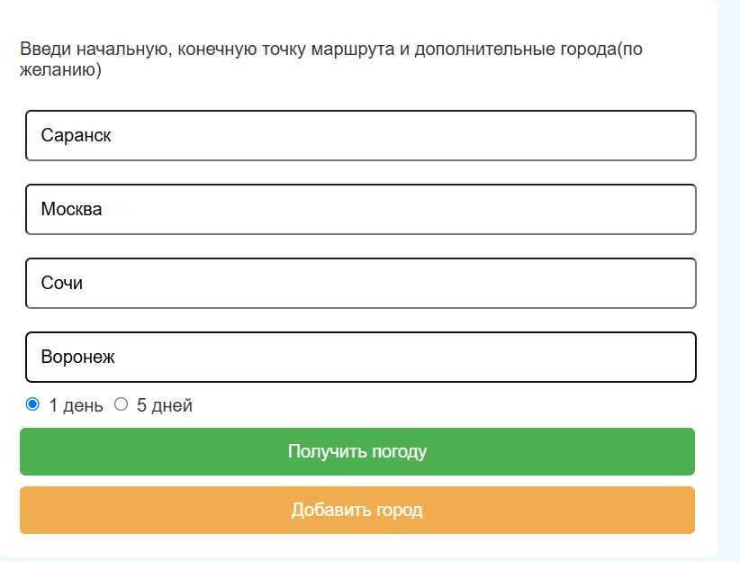
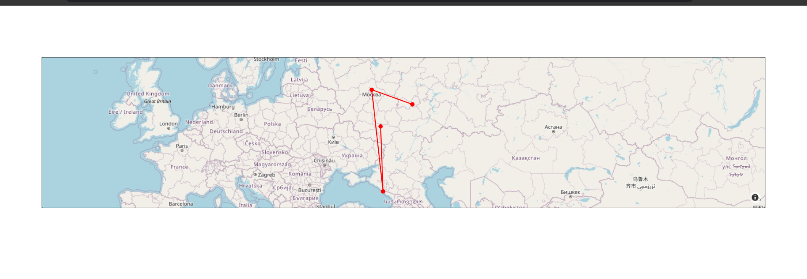
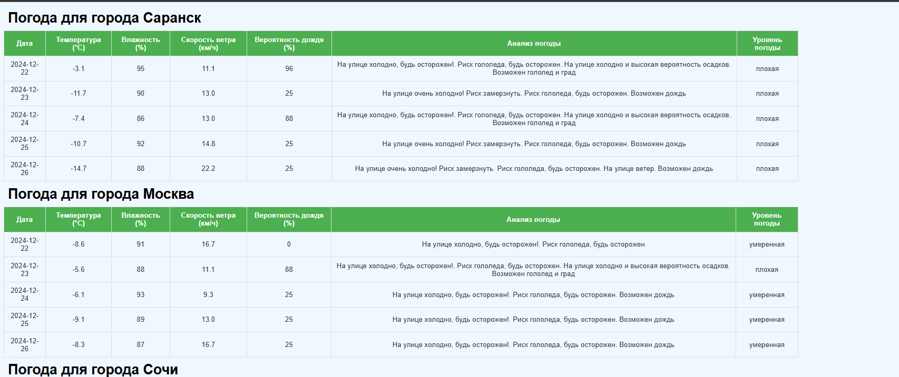

Ответы на вопросы:
1. Какие графики лучше всего подходят для визуализации погодных данных? когда у нас 1 день, то лучше подойдет столбчатая графика, так как изменения у городов по дням у нас нет(поэтому scatter plot не подойдет), а сравнивать погоду между самими городами можно с помошью столбчатой. Когда у нас 5 дней, то лучше сравнивать по точечному графику для каждого дня у городов
2. Как можно улучшить пользовательский опыт с помощью интерактивных графиков? Пользователь может легко сравнивать погоды между точками более подробно, так как интерактивные графики показывают значение просто наведя на него. Особенно это полезно, когда точек много

Важно: accuweather api в бесплатной версии дает смотреть только на 1 или 5 дней, поэтому в коде и сделано только под 1 и 5 дней.

С прошлой версией(проект 2) полностью поменялись сами страницы. Теперь на странице есть возможность посмотреть график и карту маршрута с несколькими городами. При графике и карте потом нужно заново проходить форму!
Принцип работы:

Стартовая страница

С доп. городами

Результаты погоды:

График для 1 дня(с возможностью переключать значение(например, температуру на скорость ветра))

Карта(при наведение на точку показывается температура)

Результат для 5 дней:

